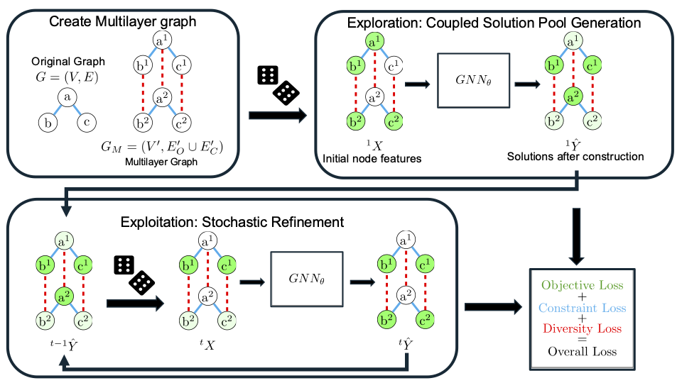
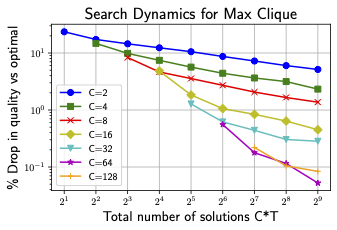
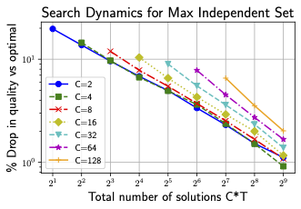

# [Learning to Explore and Exploit with GNNs For Unsupervised Combinatorial Optimization](https://openreview.net/forum?id=vaJ4FObpXN)
This repository contains the official implementation of the paper:

**Learning to Explore and Exploit with GNNs For Unsupervised Combinatorial Optimization**

## Overview


This work presents a novel approach to solving NP-hard combinatorial optimization problems using Graph Neural Networks (GNNs) in an unsupervised learning framework. Our method, X<sup>2</sup>GNN, effectively balances exploration and exploitation to find high-quality solutions for classic graph problems. 

X<sup>2</sup>GNN is an iterative framework where  set of correlated solutions are generated simultaneously at each iteration.
- Generation: Mulitple correlated solutions are generated from scratch
- Stochastic Refinement: Focus search towards promising trajectorys (partial solutions)
 
After training with a single stochastic refinement step, the model is able to significantly improve solutions with additional test-time-compute.

<div align="center">
  
</div>

## Repository Structure

```
.
├── x2gnn/              # Main implementation code
│   ├── mis/            # Maximum Independent Set implementation
│   ├── clique/         # Maximum Clique implementation
│   └── max_cut/        # Maximum Cut implementation
├── data/               # Graph datasets for each problem
└── models/             # Pre-trained models and saved checkpoints
```

## Installation

```bash
# Clone the repository
git clone https://github.com/utkuumur/x2gnn.git
cd x2gnn

# Clone the conda environment
conda env create -f envrionment.yml
```

## Usage

### Maximum Independent Set (MIS)
To replicate the results with pretrained models:

```bash
cd x2gnn/mis
sbatch pretrained.sh
```

To train models from scratch:

```bash
cd x2gnn/mis
sbatch rb200-300.sh
sbatch rb800-1200.sh
sbatch er700-800.sh
```

The results will be under `logs/$DATASET/eval_8x256.log` and `logs/$DATASET/eval_32x1024.log`

### Maximum Clique (MC)
To replicate the results with pretrained models:

```bash
cd x2gnn/clique
sbatch pretrained.sh
```
To train models from scratch:
```bash
cd x2gnn/clique
sbatch rb200-300.sh
```
The results will be under `logs/$DATASET/eval_32x64.log`

### Maximum Cut (MCut)
To replicate the results with pretrained models:
```bash
cd x2gnn/max_cut
sbatch pretrained.sh
```

To train models from scratch:
```bash
cd x2gnn/max_cut
sbatch ba200-300.sh
sbatch ba800-1200.sh
```

The results will be under `logs/$DATASET/eval_8x256.log` and `logs/$DATASET/eval_32x256.log`

## Pretrained Models

We provide pretrained models for all three problems in the `models/` directory:
- Models for Maximum Independent Set: 
    - `mis/pretrained/rb200-300.pt`
    - `mis/pretrained/rb800-1200.pt`
    - `mis/pretrained/er700-800.pt` 
- Models for Maximum Clique
    - `clique/pretrained/rb200-300.pt`
- Model for Maximum Cut
    - `max_cut/pretrained/ba200-300.pt`
    - `max_cut/pretrained/ba800-1200.pt`

## Datasets

The `data/` directory contains graph datasets used in our experiments:
- rb200-300
- rb800-1200
- er700-800
- ba200-300
- ba800-1200


To use your own graph dataset, convert your data into a list of Networkx graphs and place it in the `data/custom/{train,test}_graphs.pkl` directory.

## Main Results

Our method achieves state-of-the-art performance on multiple benchmark datasets (drop in solution quality compared to the virtual best or optimal):

| Problem | Dataset | Previous Learning-based SOTA | X<sup>2</sup>GNN (Ours) |
|:-------:|:-------:|:----------------------------:|:------------:|
| Maximum Clique  | rb200-300   | 14.54%        | 0%            |
| Maximum Clique  | rb800-1200  | 22.71%        | 1.19%         |
| Maximum  Independent Set     | rb200-300   | 4.31%         | 0.4%          |
| Maximum  Independent Set     | rb800-1200  | 10.06%        | 0.94%         |
| Maximum  Independent Set     | er700-800   | 3.55%         | 0.72%         |
| Maximum Cut | ba200-300   | 0.03%         | 0.01%         |
| Maximum Cut | ba800-1200   | 0.0%         | 0%            |

## Neural Search Dynamics 
For a fixed budget,  X<sup>2</sup>GNN can controllably balance exploration and exploitation by trading off the number of solution couples generated at each iteration C, with the number of iterations T taken. We investiage how to use the available test-time-compute most effectively. 

Figures demonstrates that MC benefits from prioritizing exploration (higher C), with C=64 providing optimal performance. Conversely, they shows that MIS performs better with emphasis on exploitation (higher T, lower C), with C=4 yielding the best results.
### Clique 
<div align="center">
  
</div>

### Independent Set 
<div align="center">
  
</div>

## Citation

If you find our work useful, please cite our paper:

```bibtex
@inproceedings{acikalin2025learning,
title={Learning to Explore and Exploit with {GNN}s for Unsupervised Combinatorial Optimization},
author={Utku Umur ACIKALIN and Aaron M Ferber and Carla P Gomes},
booktitle={The Thirteenth International Conference on Learning Representations},
year={2025},
url={https://openreview.net/forum?id=vaJ4FObpXN}
}
```
